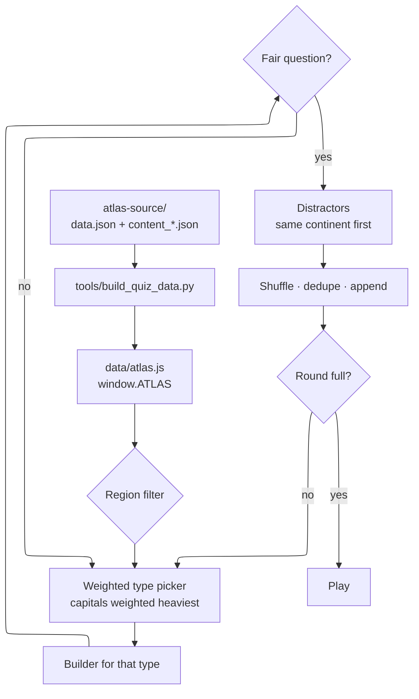

# Our World — Atlas Trivia

A trivia web app built from the **Our World Atlas**: 195 countries, their capitals,
585 landmarks and a fun fact apiece. Pick a round length, choose how wide to cast
the net, and play.

No build step, no dependencies, no server — open `index.html` and it runs.

---

## Quick start

```bash
# just open it
xdg-open index.html

# or serve it, if you prefer a http:// origin
python3 -m http.server 8000     # then visit http://localhost:8000
```

---

## What you can choose

| Setting | Options |
| --- | --- |
| **Length** | 5, 10, 15, 20 or 25 questions |
| **Topic** | Capitals only · Mostly capitals *(default)* · The full atlas |
| **Region** | Whole world, or a single continent |

Rounds are generated fresh each time, so the same settings never replay the same quiz.

---

## Question types

Capitals carry the round — they make up roughly **three quarters** of questions in
the default mix, and all of them in *Capitals only*.

| Type | Asks | Topic |
| --- | --- | --- |
| `capital` | What is the capital of X? | all |
| `country` | X is the capital of which country? | all |
| `landmark` | In which capital would you find X? | all |
| `blurb` | Which capital is described here? | all |
| `continent` | Which continent is X in? | mixed, full |
| `currency` | Which currency is used in X? | mixed, full |
| `language` | Which language is official in X? | mixed, full |
| `population` | Which of these has the largest population? | full |
| `area` | Which of these covers the most land? | full |
| `landlocked` | Which of these is landlocked? | full |
| `fun` | Which country is this true of? | full |
| `official` | Which country is formally called X? | full |

---

## How a round is built



A builder returns `null` whenever the country can't support a fair question, and the
picker simply tries another type. That is what lets a thin region — Oceania has 14
countries and no landlocked ones — still fill a 25-question round.

---

## Keeping questions fair

Generated questions can give themselves away. These guards are in `app.js`, each
one found by generating thousands of rounds and asserting on them:

- **Self-naming countries.** *"What is the capital of Singapore?"* is a freebie, so
  Djibouti, Singapore, Luxembourg, Monaco and Vatican City are skipped for capital
  questions. Near-misses like *Mexico → Mexico City* are kept — knowing which form
  is the city is a real question.
- **Landmarks that name their city.** *"Casbah of Algiers"* is excluded; *"Botswana
  National Museum"* is kept, since it still takes knowing Gaborone.
- **Self-naming languages.** *Japan → Japanese* is dropped. Rwanda still works,
  because it offers French alongside Kinyarwanda.
- **Continents in country names.** South Africa and the Central African Republic
  answer that question in their own names.
- **Distractors that are also correct.** A country's *other* official languages and
  currencies are excluded from the wrong answers — Canada is officially English
  **and** French.
- **Masked descriptions.** Capital blurbs and fun facts have the country and capital
  redacted before being shown as a clue.

---

## Regenerating the data

`data/atlas.js` is generated and checked in, so the app is self-contained. To rebuild
it after the atlas source changes:

```bash
python3 tools/build_quiz_data.py --source ../atlas-source
```

The script reports coverage and exits non-zero if any country is missing a capital,
a blurb or its three landmarks.

It emits a `.js` file rather than `.json` deliberately: `fetch()` is blocked under
`file://`, so shipping the data as a script keeps the app working when `index.html`
is opened by double-clicking it.

---

## Notes

- **Keyboard.** Press <kbd>1</kbd>–<kbd>4</kbd> to answer, <kbd>Enter</kbd> to advance.
- **Theme.** Follows your OS by default; the toggle overrides and is remembered.
- **Personal best.** Kept per length/topic/region combination in `localStorage`.
- **Accessibility.** Passes axe-core with zero WCAG 2.1 AA violations across every
  screen in both themes.
- **Testing.** `window.OurWorldQuiz` exposes `buildQuiz`, `BUILDERS` and `TOPICS`
  so a spec can generate rounds and assert on them without driving the UI.
